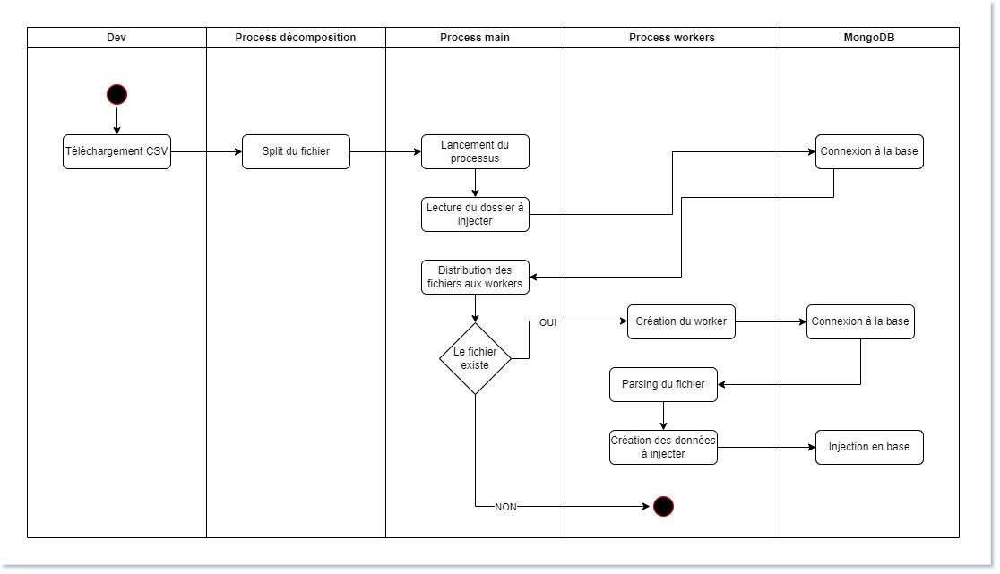
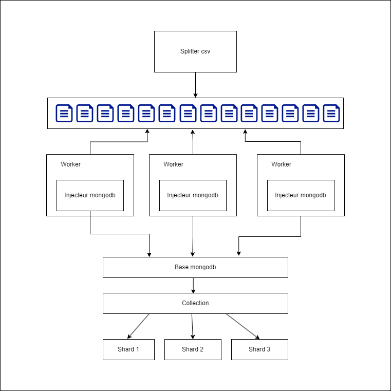

# Injecteur MongoDB

Ce projet permet d'injecter des données CSV massives dans une base MongoDB.

## Diagramme d'activité

## Schema de processus

## Lancement du script

### Découper un fichier au lancement
`node index.js <path>`

### Lancer le script sans découper le fichier
`pm2 start process.json` ou `node index.js`

### /assets
Contient les schémas et diagrammes

### /bdd
Contient les utilitaires de base de données

#### utils.js
Contient les fonctions utilitaires de connexion à la base

### /csv
Contient les fonctions pour traiter les fichiers

#### parse.js
Permet de parser un fichier et de récupérer les données sous forme d'objets JS et insère les données en base
#### split.js
Permet le découpage de fichiers csv en fichiers de 50 000 lignes
#### utils.js
Contient les fonctions utilitaires pour les entêtes de fichiers

### /model
Contient le modèle Mongoose

## Pré-requis
- Nodejs
- pm2 installé globalement
- Dépendances installées (npm install)